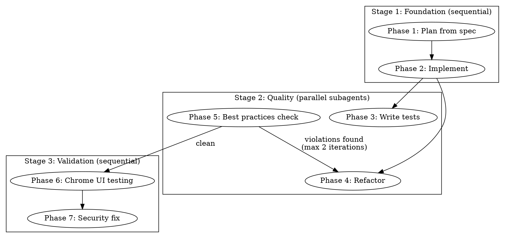

# Orchestrate: Spec-to-Code Pipeline

## Overview

Takes a specification file and autonomously builds it end-to-end: creates an implementation plan, writes all code, adds tests, refactors to TypeScript/React best practices, verifies via Chrome browser testing, and fixes security issues. Fully autonomous — no user gates between phases.

## Arguments

- **spec_file** (required): Path to a markdown specification file. Passed as the first argument after the command: `/orchestrate path/to/spec.md`

## Pipeline

Three stages, seven phases:



## Phase 1: Plan from Spec

Read the spec file and produce a structured implementation plan.

### Steps

1. Read the spec file at the path provided by the user
2. Analyze the spec to identify:
   - Components and modules to build
   - Data flow between components
   - External dependencies (npm packages)
   - Build order (what depends on what)
3. Create the plan file at `docs/plans/YYYY-MM-DD-<topic>-plan.md` with this structure:
   - Goal (one sentence)
   - Architecture (2-3 sentences)
   - Tech stack
   - Ordered list of files to create, each with:
     - Exact file path
     - Purpose (one sentence)
     - Key exports/interfaces
     - Dependencies on other files
4. Use the Task tool with `subagent_type: "Plan"` to analyze the spec if it is complex (>200 lines)

### Output

Plan file saved to `docs/plans/`. Print: "Phase 1 complete: plan saved to [path]"

## Phase 2: Implement the Plan

Execute the plan from Phase 1 to create all source code.

### Steps

1. Read the plan file created in Phase 1
2. Create project scaffolding if it does not exist:
   - `package.json` with dependencies listed in the plan
   - `tsconfig.json` for TypeScript
   - Directory structure as defined in the plan
3. Install dependencies: run `npm install`
4. Implement each file in the plan's build order:
   - Write the complete file contents (no placeholder TODOs)
   - Follow TypeScript strict mode
   - Use the exact file paths from the plan
5. Verify the project compiles:
   - Run `npx tsc --noEmit`
   - Fix any type errors before proceeding
6. For large plans (10+ files), use the Task tool with `subagent_type: "general-purpose"` to implement independent modules in parallel. Assign clear file ownership per subagent to avoid conflicts.

### Output

All source files created. Print: "Phase 2 complete: [N] files created. TypeScript compilation: PASS/FAIL"

## Phase 3: Write Tests (parallel subagent)

Create test files for all source code. Runs as a subagent in parallel with Phases 4-5.

**File ownership:** This subagent ONLY creates new `*.test.ts` and `*.test.tsx` files. It does NOT modify source files.

### Steps

1. Read the implementation plan and all source files
2. For each source file, create a corresponding test file:
   - `src/foo.ts` -> `src/foo.test.ts`
   - `src/components/Bar.tsx` -> `src/components/Bar.test.tsx`
3. Write tests using Vitest and React Testing Library:
   - Unit tests for utility functions (input/output, edge cases, error cases)
   - Unit tests for custom hooks (using `renderHook`)
   - Component tests for React components (render, user interactions, state changes)
   - Integration tests for module interactions
4. Set up test configuration if missing:
   - Add `vitest` and `@testing-library/react` to devDependencies
   - Create `vitest.config.ts` if it does not exist
5. Run the full test suite: `npx vitest run`
6. Fix any test failures caused by test code bugs
7. If tests fail due to source code bugs, note them in output but do not modify source files

### Output

Print: "Phase 3 complete: [N] test files created. Tests: [P] passed, [F] failed. Source bugs found: [list or 'none']"

## Phase 4: Refactor Code (parallel subagent)

Refactor source code to meet TypeScript/React quality standards. Runs as a subagent in parallel with Phase 3.

**File ownership:** This subagent ONLY modifies existing source files (`src/**/*.ts`, `src/**/*.tsx`). It does NOT touch test files.

### Rules

| Rule | Threshold |
|------|-----------|
| Max file length | 300 lines |
| Max function length | ~30 lines |
| TypeScript `any` | Forbidden — use proper types |
| Return types | Explicit on all exported functions |
| Unused code | Remove dead code and unused imports |
| React components | Decompose components >100 JSX lines into subcomponents |
| Hooks | Extract complex logic into custom hooks |
| Memoization | Apply `useMemo`/`useCallback` for expensive computations or stable references passed to children |

### Steps

1. Read all source files in `src/`
2. For each file, check against the rules table above
3. Refactor violations:
   - Split long files into multiple modules
   - Extract long functions into smaller named functions
   - Replace `any` with proper types or generics
   - Add explicit return types to exports
   - Remove unused imports and dead code
   - Decompose large React components
4. After refactoring, verify TypeScript still compiles: `npx tsc --noEmit`

### Output

Print: "Phase 4 complete: [N] files refactored. Changes: [summary of what was split/extracted]"

## Phase 5: Best Practices Check (parallel subagent)

Review code against the quality checklist. If violations remain, trigger another refactor pass.

### Checklist

- [ ] All files <= 300 lines
- [ ] All functions <= ~30 lines
- [ ] No `any` types anywhere
- [ ] No `console.log` in production code (allowed in test files)
- [ ] No swallowed errors (empty catch blocks)
- [ ] Consistent naming: camelCase for functions/variables, PascalCase for components/types
- [ ] Explicit return types on all exported functions
- [ ] No unused imports or variables

### Steps

1. Wait for Phase 4 (refactor) to complete
2. Read all source files and check each item in the checklist
3. If ALL items pass: proceed to Stage 3
4. If ANY items fail:
   - Log which rules are violated and in which files
   - Run Phase 4 again with the specific violations noted
   - After second refactor, check again
   - Maximum 2 total iterations of Phase 4 + Phase 5
   - If violations remain after 2 iterations, log them and proceed anyway

### Output

Print: "Phase 5 complete: Best practices [PASS/FAIL]. Iterations: [1 or 2]. Remaining violations: [list or 'none']"

## Phase 6: Chrome UI Testing

Build and launch the app, then use Claude in Chrome browser automation to test user flows.

### Steps

1. Wait for all Stage 2 subagents to complete
2. Run tests to confirm they still pass after refactoring: `npx vitest run`
   - If tests fail, fix the issues before continuing
3. Build the application: `npm run build` (or the project's build command)
4. Launch the application (e.g., `npm start` or `npx electron .`)
5. Use `mcp__claude-in-chrome__tabs_context_mcp` to get browser context
6. Use Chrome automation tools to test core user flows:
   - Navigate the UI: `mcp__claude-in-chrome__read_page` to understand the layout
   - Click buttons: `mcp__claude-in-chrome__computer` with `action: "left_click"`
   - Fill forms: `mcp__claude-in-chrome__form_input`
   - Take screenshots: `mcp__claude-in-chrome__computer` with `action: "screenshot"`
   - Read page state: `mcp__claude-in-chrome__find` to locate elements
7. For each user flow:
   - Document what was tested
   - Record pass/fail
   - Take a screenshot as evidence
8. If the app does not have a web UI accessible in Chrome (e.g., pure CLI), skip this phase and note it

### Output

Print: "Phase 6 complete: [N] user flows tested. Passed: [P]. Failed: [F]."
List each flow with pass/fail status.

## Phase 7: Security Fix

Scan for security issues and fix what is fixable.

### Steps

1. Run dependency audit: `npm audit`
   - If vulnerabilities found, run `npm audit fix` for auto-fixable ones
   - Log any remaining vulnerabilities with severity
2. Scan for hardcoded secrets:
   - Search all source files for patterns: API keys, tokens, passwords, connection strings
   - Use Grep tool with patterns: `(api[_-]?key|secret|password|token|credential)\s*[:=]`
   - If found: replace with environment variable references and add to `.env.example`
3. OWASP Top 10 code review — check for:
   - **XSS**: `dangerouslySetInnerHTML`, unescaped user input in JSX
   - **Injection**: User input passed to `child_process.exec`, `eval()`, or shell commands
   - **Insecure IPC**: Electron `ipcMain` handlers that do not validate input
   - **Prototype pollution**: `Object.assign` with user-controlled input
   - **Path traversal**: File reads using user-controlled paths without sanitization
4. Fix all issues found:
   - Replace `dangerouslySetInnerHTML` with safe alternatives
   - Use `child_process.execFile` instead of `exec` for shell commands
   - Add input validation to IPC handlers
   - Sanitize file paths
5. Verify TypeScript still compiles and tests still pass after fixes

### Output

Print: "Phase 7 complete: [N] security issues found. [M] fixed. [K] unfixable (listed below with file:line)."

## Execution

When this skill is invoked:

1. **Create tasks** using TaskCreate for each of the 7 phases to track progress
2. **Stage 1** — Run Phase 1 and Phase 2 sequentially as the main agent:
   - Mark each task in_progress before starting, completed when done
3. **Stage 2** — Launch three parallel subagents using the Task tool:
   - Subagent A (`subagent_type: "general-purpose"`): Phase 3 (write tests) — creates `*.test.*` files only
   - Subagent B (`subagent_type: "general-purpose"`): Phase 4 (refactor) — modifies `src/**` files only
   - Subagent C (`subagent_type: "general-purpose"`): Phase 5 (best practices) — reads all files, triggers Phase 4 rerun if needed
   - Subagent C must wait for Subagent B to complete before checking
   - If Phase 5 finds violations, launch a new Phase 4 subagent (max 2 iterations total)
   - Wait for ALL Stage 2 subagents to complete before proceeding
4. **Stage 3** — Run Phase 6 and Phase 7 sequentially as the main agent:
   - Phase 6 uses Chrome automation tools
   - Phase 7 scans and fixes security issues

## Summary Template

After all phases complete, print this summary:

```
═══════════════════════════════════════════
  ORCHESTRATE PIPELINE COMPLETE
═══════════════════════════════════════════

  Spec:          [spec file path]
  Plan:          [plan file path]

  STAGE 1 — Foundation
  ✓ Plan:        [N] tasks identified
  ✓ Implement:   [N] files created

  STAGE 2 — Quality
  ✓ Tests:       [P] passed, [F] failed
  ✓ Refactor:    [N] files changed ([1-2] iterations)
  ✓ Practices:   [PASS/FAIL] ([violations] remaining)

  STAGE 3 — Validation
  ✓ UI Tests:    [P] passed, [F] failed
  ✓ Security:    [N] found, [M] fixed, [K] unfixable

  No git commits created. Run /commit when ready.
═══════════════════════════════════════════
```

## Common Mistakes

| Mistake | Fix |
|---------|-----|
| Subagents editing the same files | Enforce file ownership: tests create new files, refactor edits source only |
| Refactor loop runs forever | Cap at 2 iterations of Phase 4 + Phase 5, then proceed |
| Skipping compilation check after refactor | Always run `npx tsc --noEmit` after Phase 4 |
| Chrome testing on non-web app | Skip Phase 6 if app has no browser-accessible UI |
| Running npm audit fix blindly | Review breaking changes before applying major version bumps |
| Leaving console.log in production | Phase 5 checklist catches this — remove or replace with proper logger |
